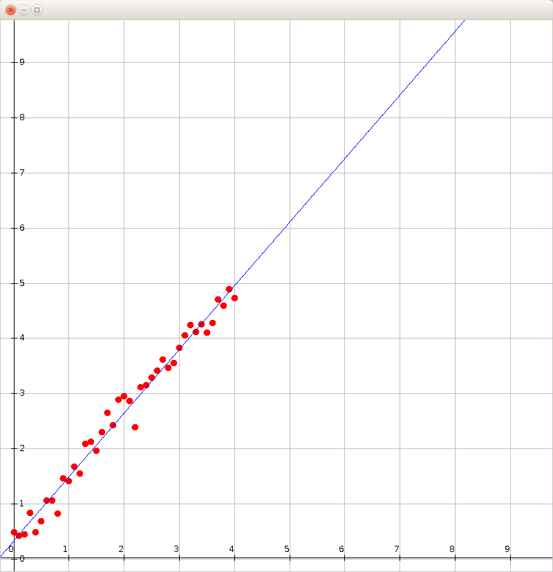
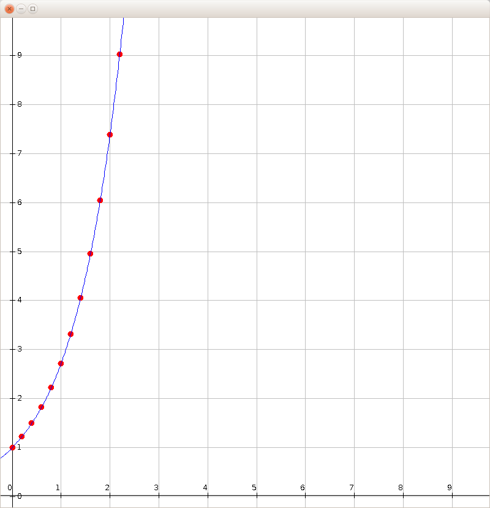
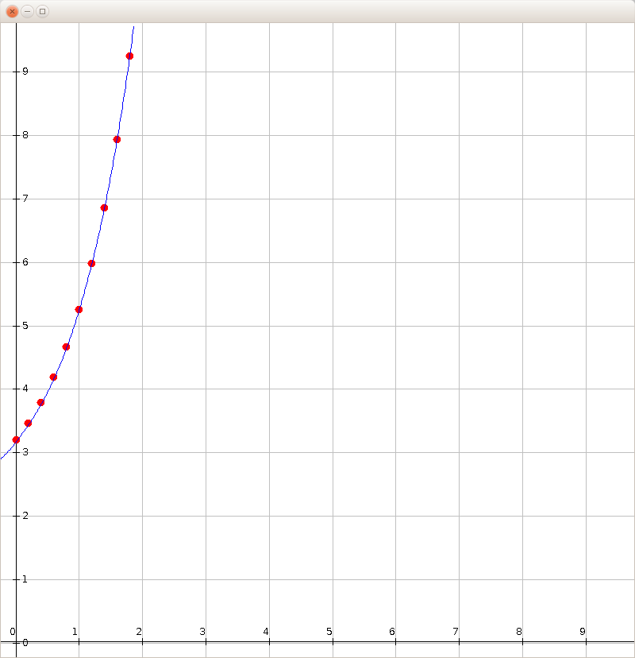

# Mathematical-function-fitting
This project showcases pure mathematical fitting procedures for several types of data. 

This project offers several purely mathematically based fitters.

Currently the project supports fitting for the following types of data: 
* **Linear data** (y=kx+l)
* **Exponential data** y=ae(b\*x)
* **Shifted exponential data** y=ae(b\*x)+c (See: [link](https://www.scribd.com/doc/14674814/Regressions-et-equations-integrales))

Example: Linear fit

Example: Exponential fit

Example: Shifted exponential fit

